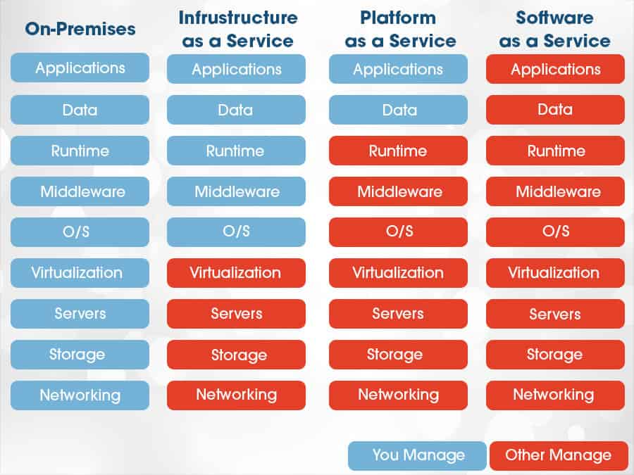

# Cloud Computing #

- **On premises** - Physical Hardware on site
    - expensive
    - difficult to scale
    - difficult to maintain

- **Cloud Computing** - Computing Resources accessed remotely on demand
    - scalabiity
    - pay as you go
    - customisable
    - low maintenance

        *Cloud Indicators*
        - Software Not Running Locally
        - Cloud Icon
        - Subscriptions
        - Metrics & Monitoring

- **Deployment Models**

    - Simple Models
        - Public Cloud - Multiple Users/ Organisations
        - Private Cloud - Single User/ Organisation (Government, Banks etc.)
    - Complex Models
        - Hybrid Cloud - MIxture of Public and Private with secure connection between them
        - Multi Cloud - Mixture of public cloud providers (Aws, Gcp, Alibaba)

- **Cloud Service Types**

    - Iaas - Infrastructure as a service - More Responsibility, More Flexibility
    - Paas - Platform as a service - Provides the environment to run applications and other services - Less Iaas constraints while more flexible than Saas
    - Saas - Software as a Service - Less Responsibility, Less Flexibility 
    - Faas - Functions as a Service - Function runs intermittently/ has different resource requirements between runs (cloud finds resources to run when needed - servers etc.)

*Service Types & Functions*

## Cloud Advantages & Disadvantages##
 
 **Advantages**
    - Cost Efficiency
    - Scalability
    - Accessibility/ Mobility
    - Cloud Provider handles updates/ maintenance
    - Security (Physical & Core Network)
    - Faster Deployment Globally
    - Faciitates Experimentation & Innovation

**Disadvantages**
    - Can be expensive if ot properly controlled & monitored
    - Compliance issues
    

